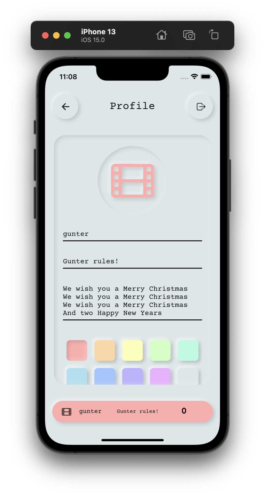
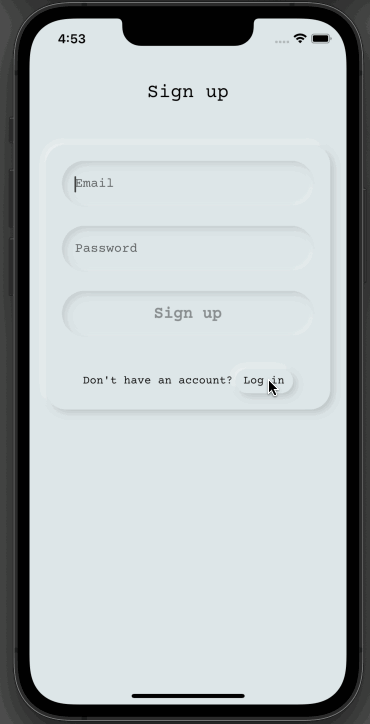
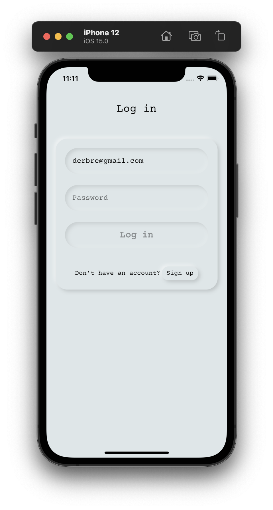
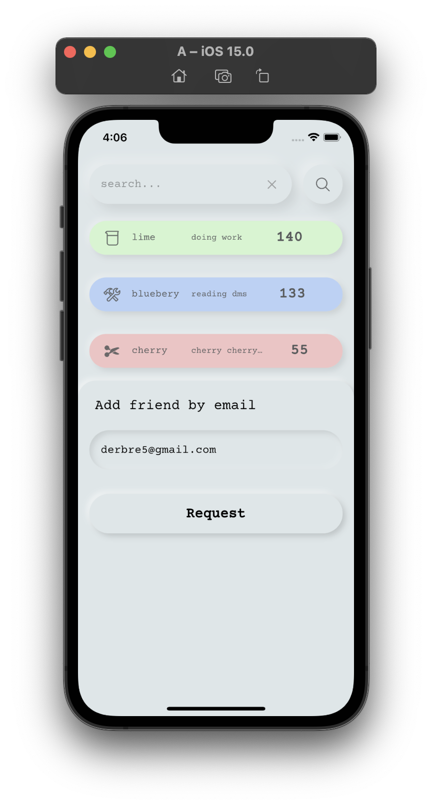
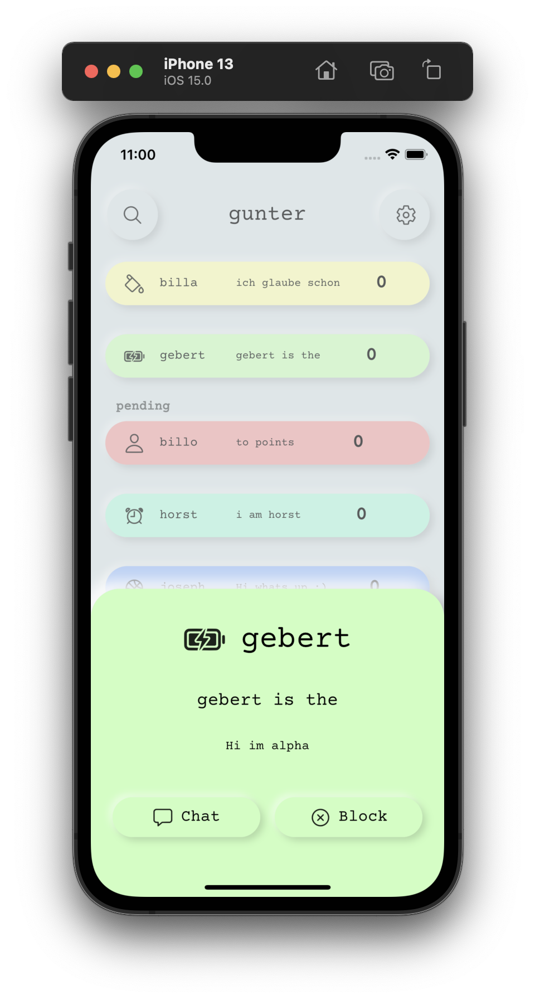

<p align="center">
    
</p>

<h1 align="center">points</h1>

<p align="center">
A mock social media app
</p>

<br>

<p align="center">
    Written in frontend with <a Dart and href="https://flutter.dev">Flutter</a> using <a href="https://pub.dev/packages/bloc">bloc</a> as state managment,<br> 
    in the backend <a href="https://supabase.com">supabase</a> is used for auth, data storage, and realtime syncing
</p>

<p float="center">
  
  
  
    
</p>

<br>

<!--- Inspired by: https://github.com/robertodoering/harpy/blob/master/README.md --->

<details open>
  <summary>Demos</summary>
  
  | **Updating friends** | **Chat** |
  | :---: | :---: |
  | <kbd></kbd> | <kbd></kbd>
</details>

<details>
    <summary>More demos</summary>
    
   | **Sign in** | **Sign up** | **Profile** |
   | :---: | :---: | :---: |
   | <kbd></kbd> | <kbd></kbd> | <kbd></kbd> |
     
</details>

<details>
  <summary>Gallery</summary>
  
  | **Sign in** | **Home** | **Profile** |
  | :---: | :---: | :---: |
  | <kbd></kbd> | <kbd></kbd> | <kbd></kbd> |
  | **Invite friend by email** | **Chat** | **Clicked on user** |
  | <kbd></kbd> | <kbd></kbd> | <kbd></kbd> |
</details>

## Idea
The idea is to mock other social media, by giving each other useless points, 
which mock likes, subscribers and karma in other social media.
This is why that app is called 'points',
the main idea revolves about giving and collecting points
and striving to have as many as possible.
The idea (the abstraction of social media down to the ranking of people)
is inspired by Black Mirror's Nosedive and Communities Meow Meow Beanz.

The application is intended as a flutter example for state management,
with bloc and for using supabase in flutter and not a serious application.

## The points system
After each day the points are redistributed,
that means 10% of your points will be converted to points,
that you have to give to someone else, '*gives*'.
If you do not give all your gives to someone else,
these gives will be destroyed and given to other people,
the amount of gives will also be taken from your points.
The lowest your points can sink to is 0,
then you are also unable to get any more gives,
until somebody else gives you points again.

## Other features
- a friend system with friends, friend requests and blocking of users
- live updating of your relations (friends, requests and blocks),
  along with the profiles of the friends
- profile editor (edit your icon, name, status, bio and color)
- chatting with all your friends
- notifications (however only inside the app)
- searching for users
- requesting to be friends with a user via email

## Technologies
### Frontend
- [Flutter](https://flutter.dev) as the main UI framework
- [flutter_neumorphic](https://pub.dev/packages/flutter_neumorphic) for the neumorphic look
- [ionicons](https://pub.dev/packages/ionicons) for the icons and [Courier Prime](https://fonts.google.com/specimen/Courier+Prime) for the font
- [supabase](https://pub.dev/packages/supabase) to connect to the supabase backend
- [flutter_bloc](https://pub.dev/packages/flutter_bloc) for the state_management
 
### Backend
- [supabase](https://supabase.com) powered by a [PostgreSQL](https://postgresql.org) database

## Getting started

### To run the project:
1. Clone the project
2. Run the script [`pub-installer.sh`](https://github.com/bit-burger/points/blob/develop/pub-installer.sh) to install the packages
3. Setup the supabase project with the matching settings and tables ([instructions](supabase/README.md))
4. Then create a new text file in the root directory called `.env`
5. In `.env` write your supabase credentials,
   that you get from your new project (Settings > API) in such a form:
```shell script
SUPABASE_URL="YOUR_SUPABASE_URL"
SUPABASE_ANON_KEY="YOUR_SUPABASE_ANON_KEY"
```
6. Run the app on your preferred device with:
```shell script
flutter run
```
