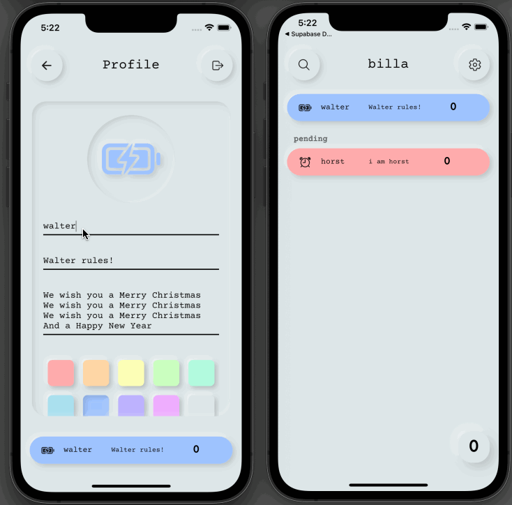
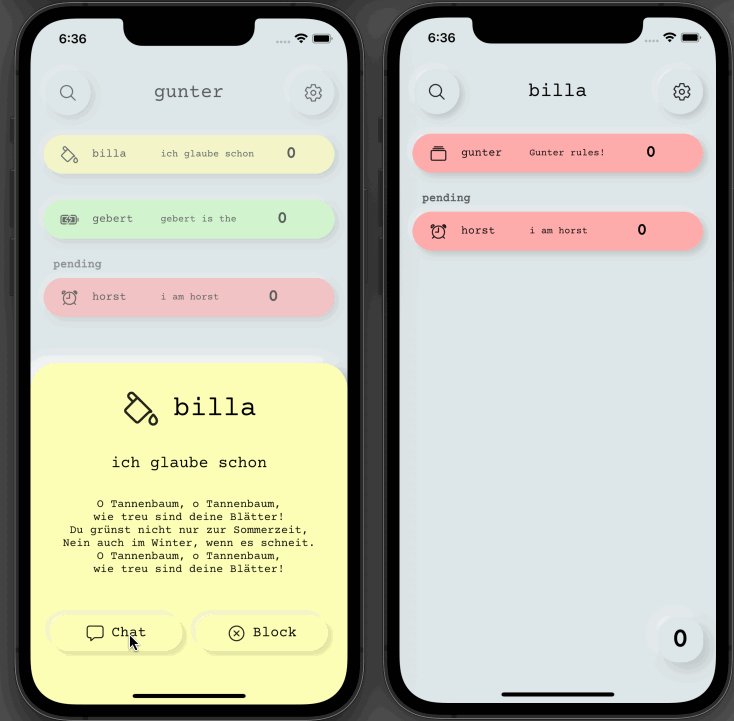

# points

A mock social media app, written in dart with Flutter, supabase is used as a backend


<p float="center">
    
    
</p>

## Features
### Sign up/Log in
<p float="left">
    
    
</p>

### Live updates to the profile


### Updating relationships


### Chatting


## Technologies
### Frontend
- [Flutter](https://flutter.dev) as the main UI framework
- [flutter_neumorphic](https://pub.dev/packages/flutter_neumorphic) for the neumorphic look
- [ionicons](https://pub.dev/packages/ionicons) for the icons and [Courier Prime](https://fonts.google.com/specimen/Courier+Prime) for the font
- [supabase](https://pub.dev/packages/supabase) to connect to the supabase backend
- [flutter_bloc](https://pub.dev/packages/flutter_bloc) for the state_management
 
### Backend
- [supabase](https://supabase.com) powered by a [PostgreSQL](https://postgresql.org) database
## Getting started

### To run the project:
1. First you must run:
 `flutter pub install`
3. Then make a new text file in the root directory called .env
4. In .env write your supabase credentials in such a form:
```shell script
SUPABASE_URL="YOUR_SUPABASE_URL"
SUPABASE_ANON_KEY="YOUR_SUPABASE_ANON_KEY"
```
2. Run the app with:
 
