<p align="center">
    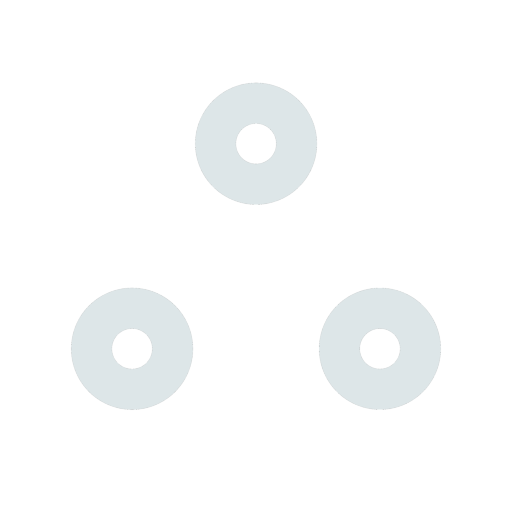
</p>

<h1 align="center">points</h1>
<h3 align="center">A mock social media app</h3>

<br>

<p align="center">
    Written in frontend with <a Dart and href="https://flutter.dev">Flutter</a> using <a href="https://pub.dev/packages/bloc">bloc</a> as the state managment,<br> 
    as well <a href="https://supabase.com">supabase</a> in the backend for auth, data storage, and realtime syncing <br><br>
    Features include authentication, a chat, notifications, updating your profile, <br>as well as a friend system (that includes friend requests and blocking)
</p>

<p float="center">
  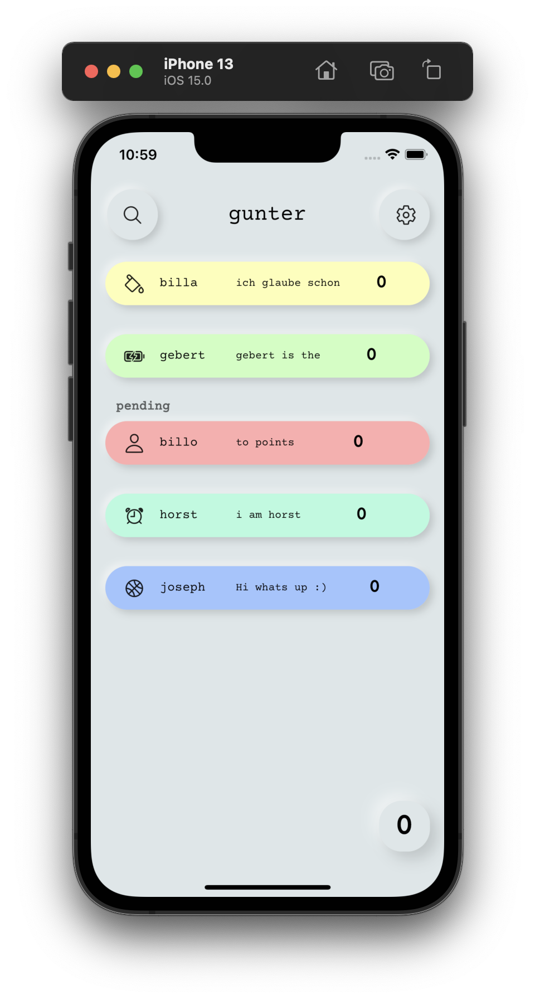
  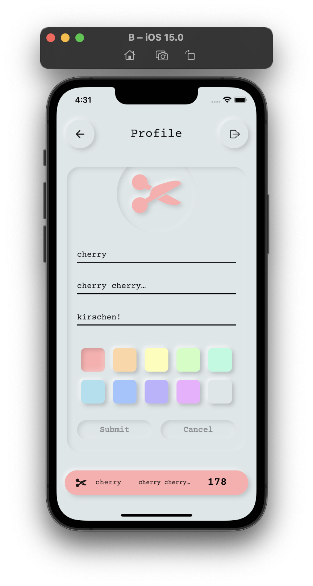
  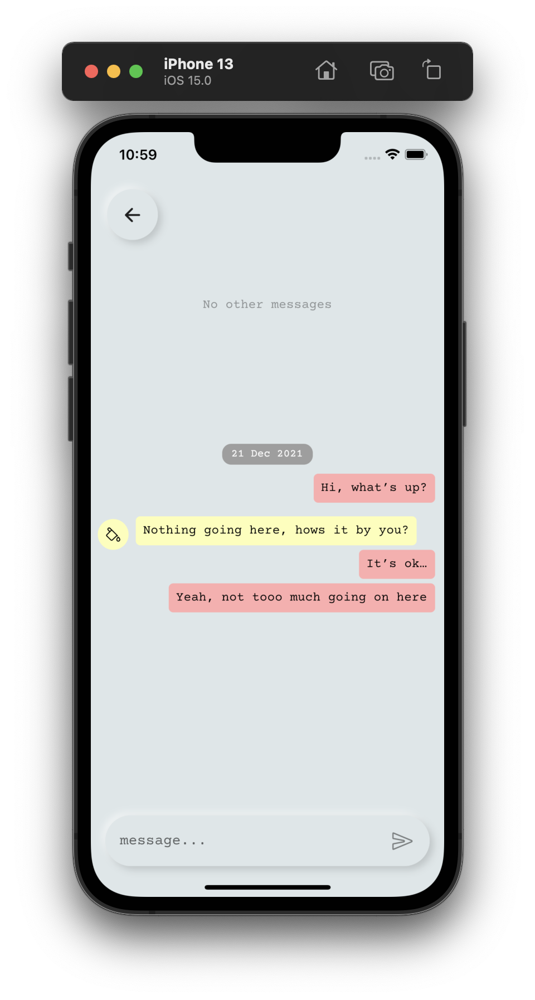
  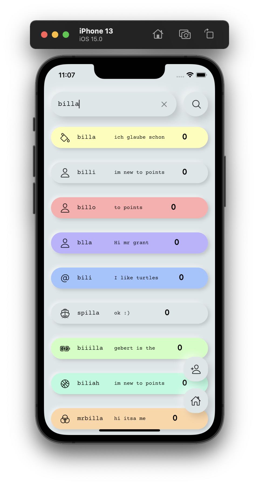  
</p>

<br>

<!---
    Design of the supabase.md heavily inspired by: 
    https://github.com/robertodoering/harpy/blob/master/README.md
--->

<details open>
  <summary>Demos</summary>
  
  | **Updating friends** | **Chat** |
  | :---: | :---: |
  | <kbd>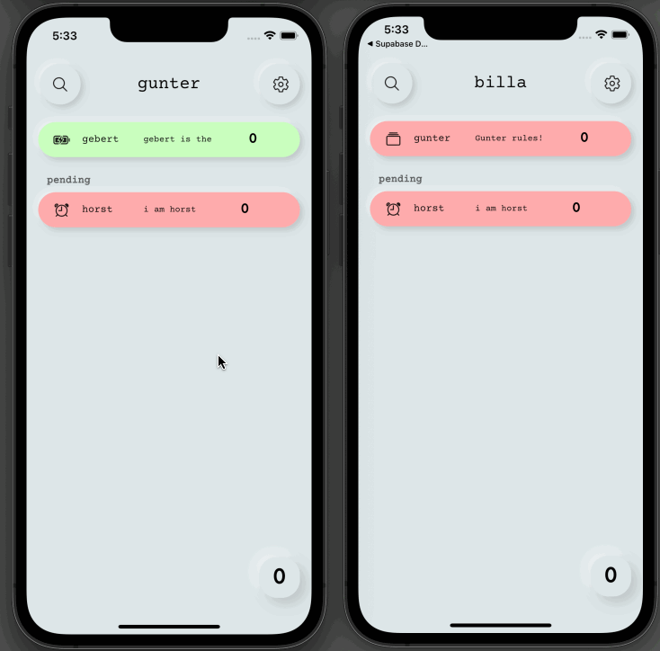</kbd> | <kbd>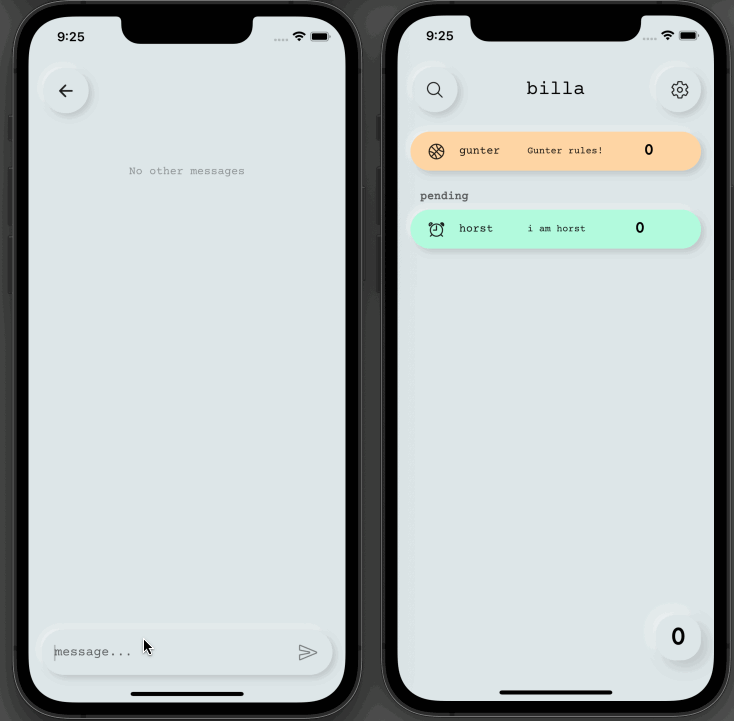</kbd>
</details>

<details>
    <summary>More demos</summary>

   | **Sign in** | **Searching for users**| **Profile** |
   |:---:| :---: | :---: |
   | <kbd>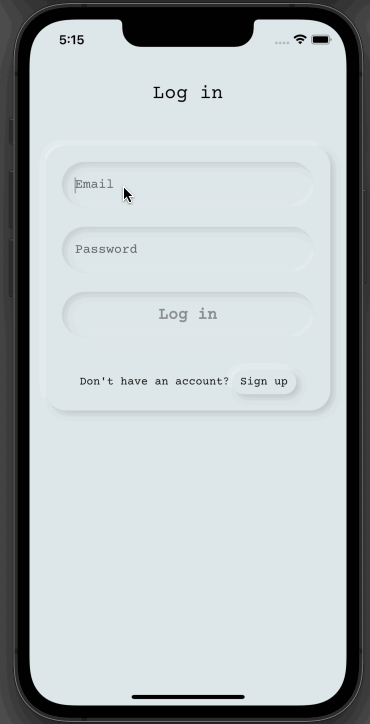</kbd> | <kbd>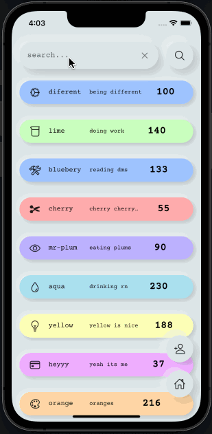</kbd> | <kbd>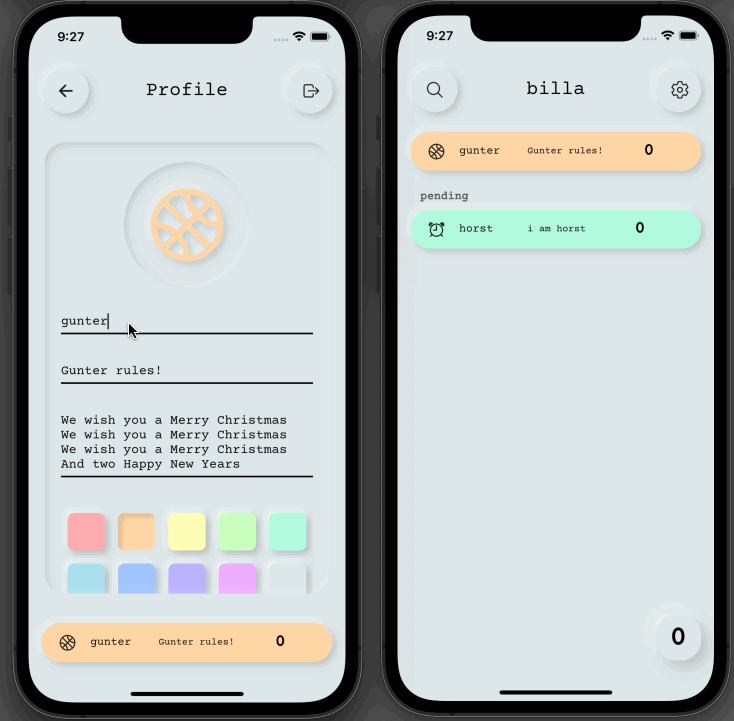</kbd> |

   | **Notifications demo** | **Giving points** |
   |:---:| :---: |
   | <kbd>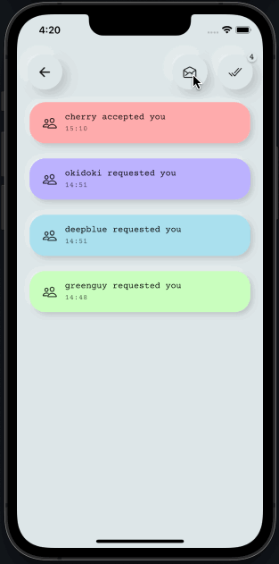</kbd> | <kbd>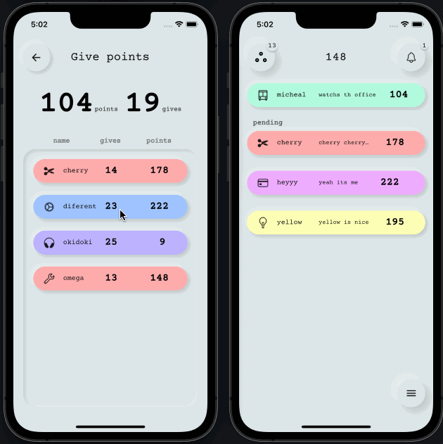</kbd>
     
</details>

<details>
  <summary>Gallery</summary>

  | <kbd></kbd> | <kbd>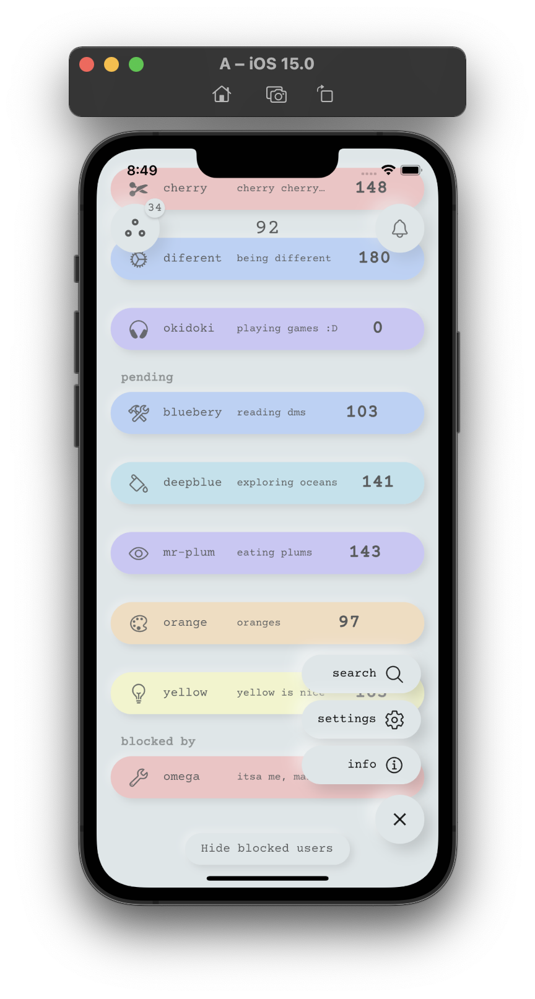</kbd> | <kbd>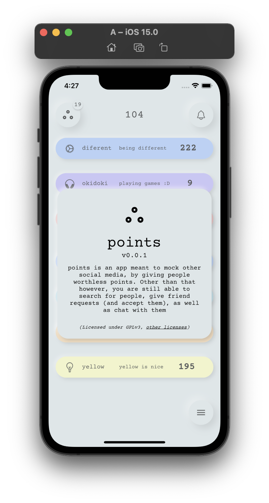</kbd> |
  | :---: | :---: | :---: |
  | <kbd>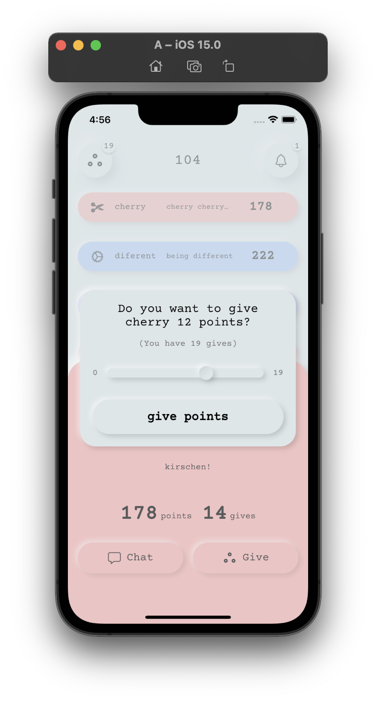</kbd> | <kbd>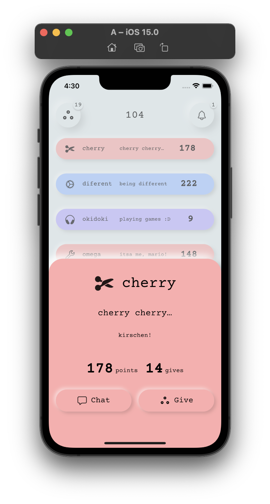</kbd> | <kbd></kbd> |
  | <kbd>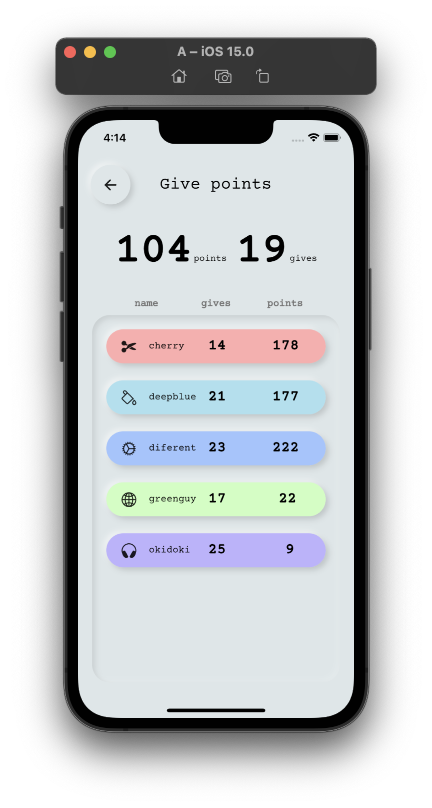</kbd> | <kbd></kbd> | <kbd>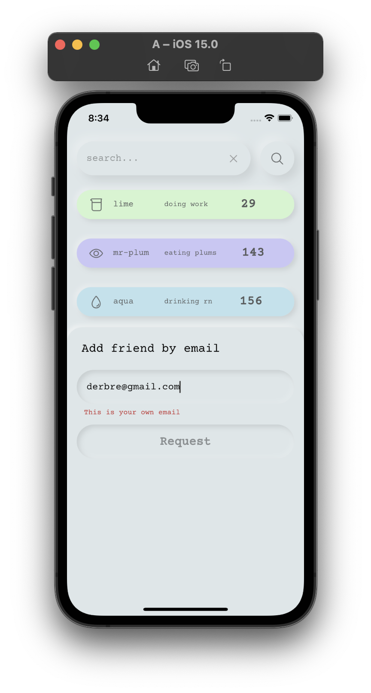</kbd> |
  | <kbd></kbd> | <kbd>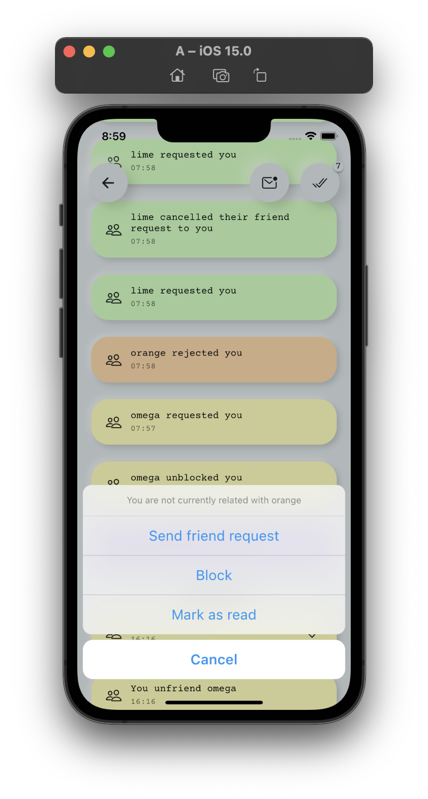</kbd> | <kbd>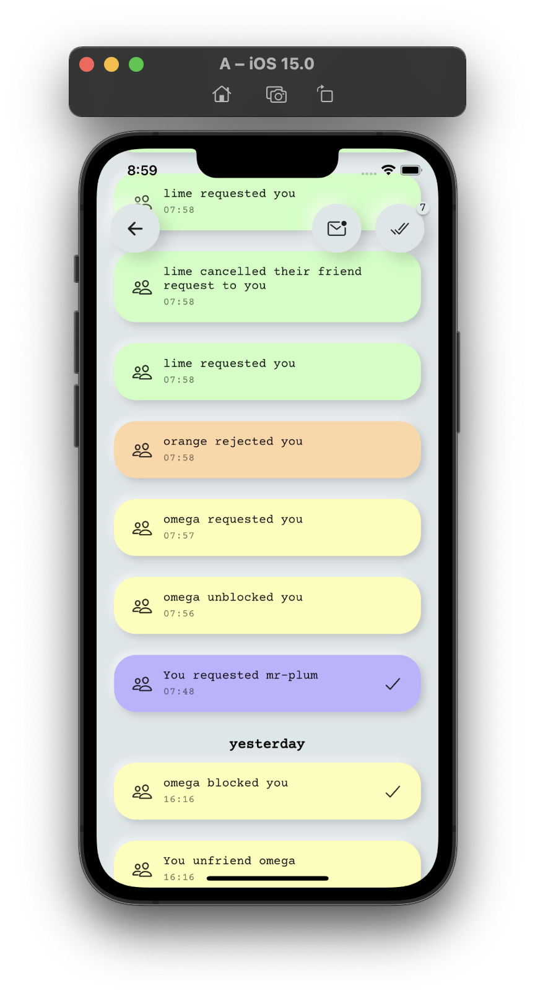</kbd> |
</details>

## Idea
The idea is to mock other social media, by giving each other useless points, 
which mock likes, subscribers and karma in other social media.
This is why that app is called 'points',
the main idea revolves about giving and collecting points
and striving to have as many as possible.
The idea (the abstraction of social media down to the ranking of people)
is inspired by Black Mirror's Nosedive and Community's Meow Meow Beanz.

The application is intended as a flutter example for state management,
with bloc and for using supabase in flutter
and is not meant to be a serious application.

### The points system
You can give points to only your friends and
after each day the points are redistributed.
That means 10% of your points will be converted to points
that you have to give to someone else, '*gives*'.

If you do not give all your gives to someone else,
these gives will be destroyed and given to other people,
the amount of gives will also be subtracted from your points.

The lowest your points can sink to is 0,
then you are also unable to get any more gives,
until one of your friends else gives you points again.

### Other features
- a friend system with friends, friend requests and blocking of users
- live updating of your relations (friends, requests and blocks),
  along with the profiles of the friends
- profile editor (edit your icon, name, status, bio and color)
- chatting with all your friends
- notifications (however only inside the app)
- searching for users
- requesting to be friends with a user via email

## Project overview
### Technologies
#### Backend
- [supabase](https://supabase.com) powered by a [PostgreSQL](https://postgresql.org) database

#### Frontend
- [Flutter](https://flutter.dev) as the main UI framework
- [flutter_neumorphic](https://pub.dev/packages/flutter_neumorphic) for the neumorphic look
- [ionicons](https://pub.dev/packages/ionicons) for the icons and [Courier Prime](https://fonts.google.com/specimen/Courier+Prime) for the font
- [supabase client library for flutter](https://pub.dev/packages/supabase) to connect to the supabase backend
- [flutter_bloc](https://pub.dev/packages/flutter_bloc) (with cubits) for the state_management
- [in app notifications](https://pub.dev/packages/in_app_notification) for notifications inside the app

[**A more in-Depth introduction to the project**](docs/project-overview.md)

<a><h3>Project timeline</h3></a>

## Getting started
### To run the project:
1. Clone the project
2. Run the script [`pub-installer.sh`](https://github.com/bit-burger/points/blob/develop/pub-installer.sh) to install the packages
3. Use the default supabase project by changing nothing
or [create a new one and use it instead](docs/supabase.md)
5. Run the app or build it with increased FPS (because of the graphically complex neumorphic design)
using [SkSL warmup to reduce the shader compilation jank](https://docs.flutter.dev/perf/rendering/shader):
```
flutter build [build target] --bundle-sksl-path flutter_01.sksl.json
```
