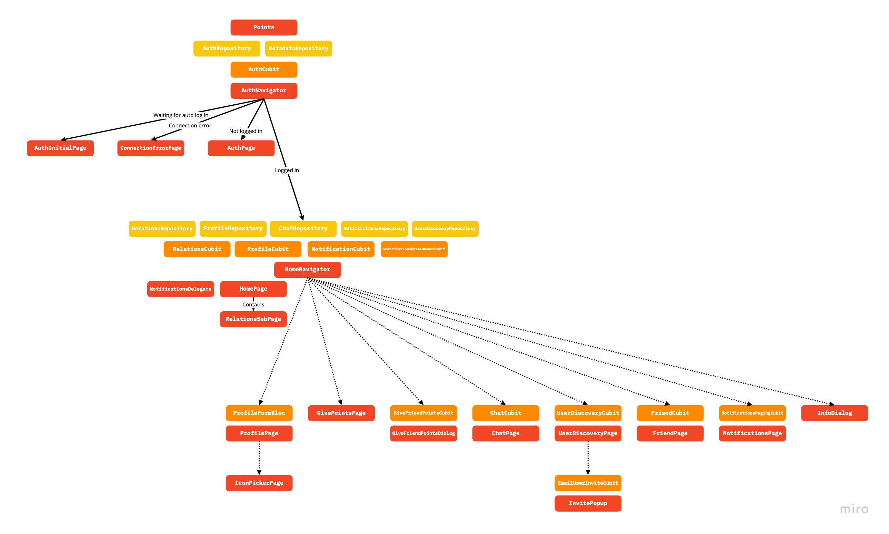

# In-depth project overview
The project starts with the [main.dart](../lib/main.dart) file, which configures all necessary services (e.g supabase)
and runs the [Points widget](../lib/points.dart) inside. Because the Project uses the repository pattern and because all repositories need a SupabaseClient,
this client is injected into all repositories using the singleton from supabase_flutter. The Points widget first provides the [AuthRepository](../packages/auth_repository/lib/src/api/auth_repository.dart)
and [MetadataRepository](../packages/meta_repository/lib/src/api/metadata_repository.dart) to the widget tree,
which are both needed in the top Cubit, the [AuthCubit](../lib/state_management/auth/auth_cubit.dart),
which is placed above the (first) Navigator, the [AuthNavigator](../lib/pages/auth/auth_navigator.dart),
which listens to the AuthCubit.

<figure>
  
  <figcaption>Diagram for the different UI pages (and delegates) (red), state management (orange) and repositories (yellow) </figcaption>
</figure>

### Authentication

The AuthCubit first tries to auto log in using the persisted credentials by an injected hive 'Box'.
While the AuthNavigator is waiting for the auto log in to complete,
it shows the [AuthInitialPage](../lib/pages/auth/auth_initial_page.dart).
If not logged in the [AuthPage](../lib/pages/auth/auth_page.dart) is shown.
The AuthCubit also handles errors, as all Cubits report errors to the AuthCubit.
If an error occurs the AuthNavigator shows the [ConnectionLostPage](../lib/pages/auth/connection_lost_page.dart),
which lets the user decide if they want to retry the connection or log out.
When the user is finally logged in, the [HomeNavigator](../lib/pages/home/home_navigator.dart) is shown,
with all other repositories and shared cubits that need the supabase client to be logged in.

### Home and navigation

The HomeNavigator first includes the [NotificationDelegate](../lib/pages/notifications/notification_delegate.dart),
which listens to the [NotificationCubit](../lib/state_management/notifications/notification_cubit.dart),
to display in app notifications in front of all pages using in_app_notifications.
For in_app_notifications to work the InAppNotification had to also be placed in the Points widget.

The HomeNavigator does not listen to any Cubit, instead it just provides all routes in the onGenerateRoute callback
and all navigation occurs in the children of the HomeNavigator, by calling its pushNamed method.
Some routes also accept a parameter, for example to open an example friend (by their id), call e.g:
`Navigator.pushNamed(context, "/friend/033d628a-bf96-4edd-add7-e10cc197032e`.
The initial page on the navigator is the HomePage,
it has a button to access the [GivePointsPage](../lib/pages/give_points/give_points_page.dart),
a button to access the [NotificationsPage](../lib/pages/notifications/notifications_page.dart)
and a menu to access the [UserDiscoveryPage](../lib/pages/user_discovery/user_discovery_page.dart),
[ProfilePage](../lib/pages/profile/profile_page.dart), and
[InfoDialog](../lib/pages/home/info_dialog.dart).

The HomePage also listens to different Cubits to display the points, gives and number of notifications in realtime in the app bar.
The actual content of the HomePage however is the [RelationsSubPage](../lib/pages/relations/relations_sub_page.dart),
which shows an in realtime updated list of the friends, friend requests sent to the user, friend requests from the user,
blocked users, and others that have blocked the user.
If clicked on a friend, a [FriendPage](../lib/pages) for that user is opened.
From the [FriendPage](../lib/pages/friend/friend_page.dart) the [ChatPage](../lib/pages/chat/chat_page.dart)
or the [GiveFriendPointsDialog](../lib/pages/give_points/give_friend_points_dialog.dart).

### Project structure

All repositories are in [packages/](../packages), in different separated dart packages,
while the state management is in [lib/state_management](../lib/state_management)
and the pages are in [lib/pages](../lib/pages), the other directories in lib/ are:
[lib/helpers](../lib/helpers), [lib/theme](../lib/theme) and [lib/widgets](../lib/widgets)
(for widgets shared between pages).

### Supabase (and other) configurations

As previously mentioned, points uses the supabase_flutter singleton, which is configured
in the [supabase_configuration.dart](../lib/supabase_configuration.dart) file,
which is called in [main.dart](../lib/main.dart). The supabase_configuration.dart file,
uses the [dotenv](https://pub.dev/packages/dotenv) package, to read the .env file, which contains the url and the supabase anon key.

The [configure_package_info.dart](../lib/configure_package_info.dart) file
configures the package_info_plus package to read the current version of the program,
which happens in the [InfoDialog](../lib/pages/home/info_dialog.dart) widget.
It is also called in the main.dart file.

### Supabase and PostgreSQL

The sql files needed in a points supabase project are found in [supabase/](../supabase)
and a guide to configure a supabase project for points is found [here](supabase.md).

In points the different repositories use their injected SupabaseClient to interface with supabase,
in points the tables profiles, relations, chats, messages, and notifications,
which are defined in [main.sql](../supabase/main.sql), are all queried and listened to directly,
without anything in between.

It is made sure
via [RLS](https://supabase.com/docs/guides/auth/row-level-security#restrict-updates),
that the user can only query/listen to the table that they are allowed to.
A user can query all profiles,
but they are only allowed to query their own relations, notifications, and chats/messages.

To however update the tables, for example send a friend request to a user,
the repositories cannot directly update the tables. Updating a profile,
getting a profile from an email, managing relations (accepting/rejecting a request, blocking, etc.).
and even complex queries like searching for users or querying all relations, are done via functions.
These functions are are defined inside of [functions.sql](../supabase/functions.sql).

It is also notable, that the authentication is from supabase.
For every new signed up user, supabase adds a new row to `auth.users` and then via a trigger,
a new profile is inserted into the `profile` table of points.
To redistribute the points at the end of the day, a crontab is used,
it is also defined inside of [main.sql](../supabase/main.sql).

### App icon and splash screen

The points icon is three different svgs in the icons folder.
The [generate-icons.sh](../icons/generate-icons.sh) script then uses imagemagick
to convert these svgs into three different pngs, which are then used
by flutter_native_splash and flutter_launcher_icons to put in the correct directories in the ios and android folders.
The configuration (path to the generated pngs, as well as colors) for these two packages
is in [pubspec.yaml](../pubspec.yaml).

### Testing and GitHub Actions

At the moment only tests for the repositories have been written.
These are executed in GitHub Actions by [.github/workflows/testing.yml](../.github/workflows/testing.yml).

The other file [.github/workflows/analyze.yml](../.github/workflows/analyze.yml),
runs the dart analyze and dart format commands, to statically analyze the project and format it.

### Design, fonts and theming

The [flutter_neumorphic](https://pub.dev/packages/flutter_neumorphic) library was used to achieve a neumorphic design.
However, [lots of custom widgets](../lib/widgets) still needed to be made, because of the relatively limited library.
The colors and theme (the app does not include support for white mode) for the app are located in [lib/theme/](../lib/theme).
These are all put together inside the [Points widget](../lib/points.dart).
For the font [Courier Prime](https://fonts.google.com/specimen/Courier+Prime) is used,
which is configured via the [google_fonts](https://pub.dev/packages/google_fonts) package.